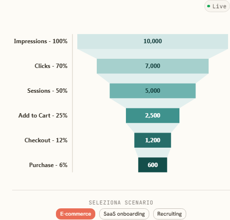

# Funnel Classic

Grafico funnel centrato in Vega per Deneb (Power BI). Mostra gli stage di conversione con valori assoluti, tasso tra stage e percentuale rispetto al vertice.

**Come si usa:** copia `classic.json` in Deneb, carica `data/classic-sample.csv` come sorgente dati nel tuo report, mappa i campi `Step`, `Value` e `Order`.

**Articolo:** https://freakinviz.com/galleria/funnel-classic/
